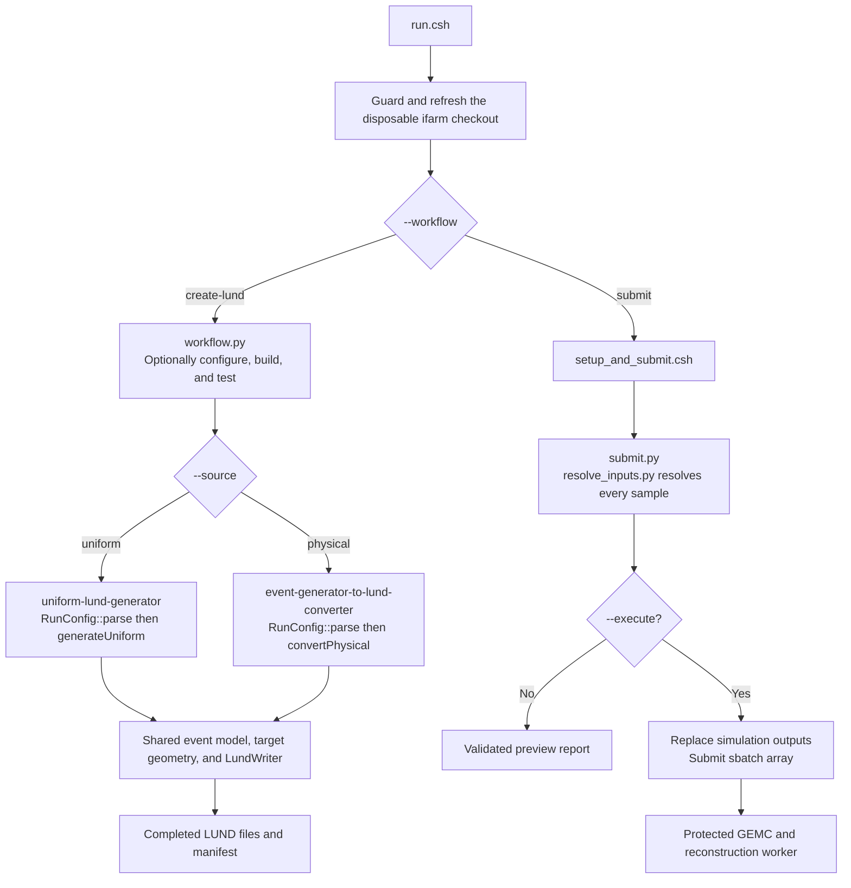

# Architecture and code walkthrough

## Source layout

Maintained code is grouped first by the two user-facing workflows. `src/lund-generation/` owns LUND creation, while `src/slurm-submission/` owns ifarm job submission. `src/launcher/` contains the shared entry-point machinery that selects either workflow. Inside LUND generation, responsibility folders remain ownership boundaries while `LundCore` compiles the small shared layers together.

| Directory | Responsibility |
| --- | --- |
| `src/lund-generation/` | Both uniform and physical LUND creation, their entry points, external geometry, and tests |
| `src/slurm-submission/` | Sourced setup/submission script, protected GEMC payload, and parity tests |
| `src/launcher/` | Shared Python dispatcher and sourced-shell support used by `run.csh` |
| `src/lund-generation/core/config/` | Parse and validate run settings; resolve RG-M target identity and metadata |
| `src/lund-generation/core/lund/` | Represent events and particles; split files, serialize LUND, and publish the manifest |
| `src/lund-generation/core/geometry/` | Adapt the protected target definitions to one sampled interaction vertex per event |
| `src/lund-generation/core/support/` | Terminal presentation and the generated-version template |
| `src/lund-generation/uniform-lund-generator/` | Produce deliberately unphysical acceptance-map events and their monitoring |
| `src/lund-generation/event-generator-to-lund-converter/` | Dispatch a physical input source to its event-generator/format adapter |
| `src/lund-generation/event-generator-to-lund-converter/genie-gst/` | Read GENIE GST as the currently implemented physical adapter |
| `src/lund-generation/external/` | Protected imported target geometry |
| `src/slurm-submission/external/` | Protected GEMC/reconstruction worker payload |

The two implementation directories intentionally match their installed executable names, so source ownership and runtime diagnostics use the same vocabulary. The GENIE reader is nested under `event-generator-to-lund-converter` as `genie-gst` because the adapter accepts one particular GENIE output format rather than every format GENIE can produce. A future adapter belongs beside it and should identify both generator and input format where necessary. Cross-layer includes state dependencies directly, for example `core/config/RunConfig.h`, `core/lund/Event.h`, and `core/geometry/TargetGeometry.h`.

## Build targets

| Target | Source | Responsibility |
| --- | --- | --- |
| `LundCore` | `src/lund-generation/core/config/`, `src/lund-generation/core/lund/`, `src/lund-generation/core/geometry/`, `src/lund-generation/core/support/` | Shared configuration-to-manifest LUND pipeline |
| `UniformGeneration` | `src/lund-generation/uniform-lund-generator/` | Uniform sampling prescriptions and uniform-only monitoring |
| `GenieGstConversion` | `src/lund-generation/event-generator-to-lund-converter/genie-gst/` | GENIE GST input adapter |
| `PhysicalConversion` | `src/lund-generation/event-generator-to-lund-converter/` | Select the configured physical event-generator/format adapter |
| `uniform-lund-generator` | `src/lund-generation/apps/uniform_lund_generator_main.cpp` | Parse CLI, call generator, report errors |
| `event-generator-to-lund-converter` | `src/lund-generation/apps/event_generator_to_lund_converter_main.cpp` | Parse physical input settings and dispatch an adapter |

The root CMake file discovers ROOT and adds subdirectories. `src/CMakeLists.txt` declares reusable libraries and target-scoped dependencies. The test targets alone compile archived reference code; production libraries do not include archived implementations. `src/lund-generation/apps/CMakeLists.txt` links entry points. Every implementation is compiled once; implementation files are never included from another implementation. ROOT macros and archived analysis helpers are excluded from production targets.

## Workflow dispatcher

The two workflows start at `run.csh`, after the guarded disposable-server refresh:



Code shown in the diagram: [`run.csh`](../../run.csh), [`workflow.py`](../../src/launcher/workflow.py), [`uniform_lund_generator_main.cpp`](../../src/lund-generation/apps/uniform_lund_generator_main.cpp), `generateUniform()`, [`event_generator_to_lund_converter_main.cpp`](../../src/lund-generation/apps/event_generator_to_lund_converter_main.cpp), `convertPhysical()`, [`setup_and_submit.csh`](../../src/slurm-submission/setup_and_submit.csh), [`submit.py`](../../src/slurm-submission/submit.py), [`resolve_inputs.py`](../../src/slurm-submission/resolve_inputs.py), and [`submit_GEMC_sample.sh`](../../src/slurm-submission/external/submit_GEMC_sample.sh).

The Python driver owns LUND build/test staging and forwards sample arguments unchanged. It reads build defaults from `config/run.json`; sample physics belongs in `config/samples/*.conf`. Submission bypasses that driver. Its Python coordinator imports the input resolver, checks and reports the preloaded environment, prepares outputs with `--execute`, and passes validated settings to `sbatch`. It consumes existing LUND files and explicitly selected GCARD/YAML resources. Scheduler defaults stay in the protected payload. Creation never submits jobs automatically. See the [submission guide](../submit-simulation/guide.md) for the full call chain and editable settings.

## Sample configuration boundary

`RunConfig.h` declares the read-only configuration object shared by uniform generation, physical conversion, and `LundWriter`; `RunConfig.cpp` implements its construction and validation. Each LUND executable calls `RunConfig::parse(argc, argv, uniform)` exactly once. The boolean selects the accepted source-specific vocabulary: uniform sampling keys when true, or physical-input provenance keys when false.

Resolution follows one fixed sequence:

```text
shared + source-specific built-in defaults
    -> optional key = value sample profile
    -> command-line overrides
    -> target/channel/beam-dependent auto values
    -> shared and source-specific validation
    -> normalized input path and final absolute run-directory path
```

The object retains values as strings so the spelling actually used by the run can be written to `lundfiles/lund-gen-monitoring/lund-gen-log.json`. Consumers use `RunConfig::get()`, `RunConfig::number()`, and `RunConfig::integer()` for checked access; the writer uses `RunConfig::values()` to serialize the full resolved configuration. Target identity may supply automatic geometry, A/Z, and GEMC variation values, but explicit overrides remain independent. Source-specific options are rejected in the wrong mode rather than accepted and ignored.

This boundary is intentionally side-effect-free with respect to run products: parsing may read the selected profile, but it does not inspect GST event contents, sample kinematics or vertices, create or replace the run directory, write LUND or monitoring files, or submit simulation. Those responsibilities begin only after parsing succeeds and remain with the uniform generator, physical adapter, writer, and submission workflow respectively.

## Following a uniform run

1. The application calls `RunConfig::parse`. Built-in defaults are merged with a `key = value` file and then command-line overrides. Unknown, repeated and invalid settings fail before opening an output directory.
2. `generateUniform()` receives the resolved `1e` or `eh` channel, selected hadron, and FD/CD region, then owns separate kinematic and vertex random streams. `TargetGeometry` samples a common interaction vertex for all particles in the event.
3. `Event` holds metadata and `Particle` values. Generation logic operates on these values, not on text formatting or shell commands.
4. `LundWriter` creates a new run directory, splits events into numbered files, and serializes all channels in the same format.
5. `UniformMonitoring` owns one ordered set of detached ROOT histograms. It preserves the archived organization and rendering style, widens vertex-z axes for the maintained target catalog, and generalizes hadron labels to proton, neutron, pip, and pim in FD or CD.
6. It writes every histogram once to `<prefix>_monitoring_plots.root` and renders the same objects to PDF and PNG for every uniform channel.
7. After output and monitoring finish successfully, `LundWriter::finish` atomically renames the completed manifest into place.

## Following a physical run

`convertPhysical()` selects the `event-generator` adapter; `genie-gst` is the implemented default. `convertGenie()` loads a `TChain("gst")` and validates required branches. Typed `TTreeReaderValue` and `TTreeReaderArray` objects obtain each entry's array lengths from ROOT leaf metadata. Before indexed access, the adapter requires nonnegative `nf`, `pdgf.GetSize() == nf`, and identical `pxf`, `pyf`, and `pzf` sizes. This validates the complete parallel-array boundary without imposing a fixed particle limit. The adapter supports only QE, MEC, RES, and DIS; another reaction requires an adapter update. It assigns the corresponding process code, filters supported PDG codes, creates an `Event`, and calls the shared writer. Physical conversion creates no ROOT monitoring file or rendered monitoring plots.

The converter stops at accepted-event capacity, input exhaustion, or the physical-input submission cutoff. Before starting a follow-up output file, it requires at least `events-per-file` inclusive input entries beginning with the current accepted entry. The first file is always allowed, and a file that has started is never interrupted by the cutoff. The comparison is intentionally entry-based, so unsupported reactions inside an allowed block can still yield a shorter LUND file. No empty rollover file is opened. Errors reading later chain entries prevent publication of a completed manifest.

## Simulation boundary

`src/slurm-submission/submit.py` combines the uniform/physical setup workflows. The small sourced `setup_and_submit.csh` bridge supplies shared colors and the inherited environment. Python checks the requested shared GEMC version, loads it in an invocation-owned environment, verifies the resulting data directory and executable, checks remaining inputs, resets simulation output directories only with `--execute`, and submits one array per sample. The protected payload owns all GEMC/reconstruction commands. No Python process runs inside the array and no maintained local-simulation workflow is provided.

## Adding functionality

- Add a sampling prescription in `src/lund-generation/uniform-lund-generator/` with validated settings and an output-level test of its distribution or invariants.
- Add another physical adapter under `src/lund-generation/event-generator-to-lund-converter/<generator-format>/` and register it behind `convertPhysical()`; keep the public executable and manifest contract unchanged.
- Replace or extend `src/lund-generation/external/targets.h`, the external geometry source, and test its vertex bounds; see [external inputs](external-inputs.md). Geometry and nuclear A/Z are separate choices.
- Add detector cards under `config/detector/` and select them explicitly at execution time.
- Resolve submission inputs from the completed manifest, explicit config and CLI; use the protected payload’s scheduler defaults.

Do not infer physics configuration from filenames or output paths. Keep the external header's global RNG isolated inside the geometry adapter; do not add application-global RNGs or duplicate LUND formatting in individual workflows.

The complete [source/API inventory](../development/source-reference.md) also covers tests, examples, error paths, and archived supporting utilities.
