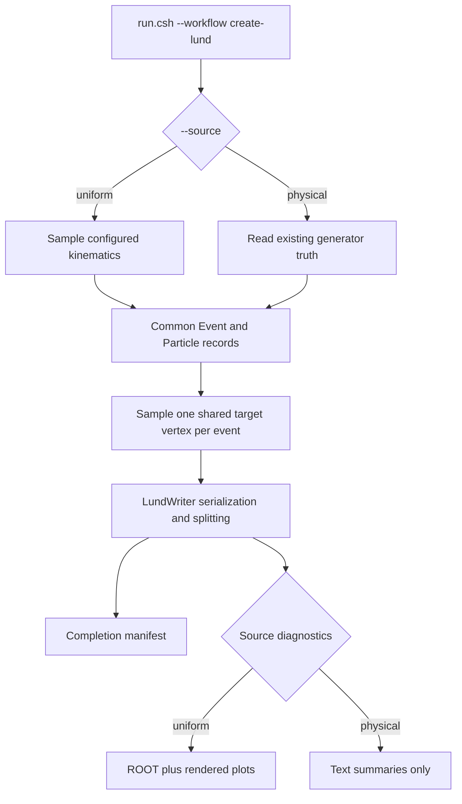

# Create LUND files

The `create-lund` workflow has one common output contract and two event sources.

## Choose a source

| Source | Use it for | Guide |
| --- | --- | --- |
| `uniform` | Deliberately unphysical acceptance samples | [Uniform samples](uniform.md) |
| `physical` | Conversion of existing event-generator truth | [Physical conversion](physical.md) |

Both sources share validated configuration, target sampling, particle records, LUND serialization, output naming, file splitting, provenance, and completion behavior where their semantics agree. They do not share event-content rules: uniform mode creates particles, while a physical adapter copies supported truth and must not invent missing kinematics.

## Pages in this section

- [Configuration reference](configuration.md): all shared and source-specific settings.
- [Command examples](examples.md): profiles, overrides, build controls, and physical provenance.
- [Uniform monitoring](monitoring.md): ROOT objects and rendered products.
- [Sample profile inventory](../../config/samples/README.md): reviewed beam/channel configurations.
- [LUND data contract](../concepts/lund-data-contract.md): serialized fields, splitting, and manifest schema.
- [Targets, seeds, and sampling](../concepts/sampling-models.md): scientific definitions and reproducibility.

Creating LUND files never submits simulation. Continue with [Submit simulation](../submit-simulation/index.md) only after a run has a completed manifest.
