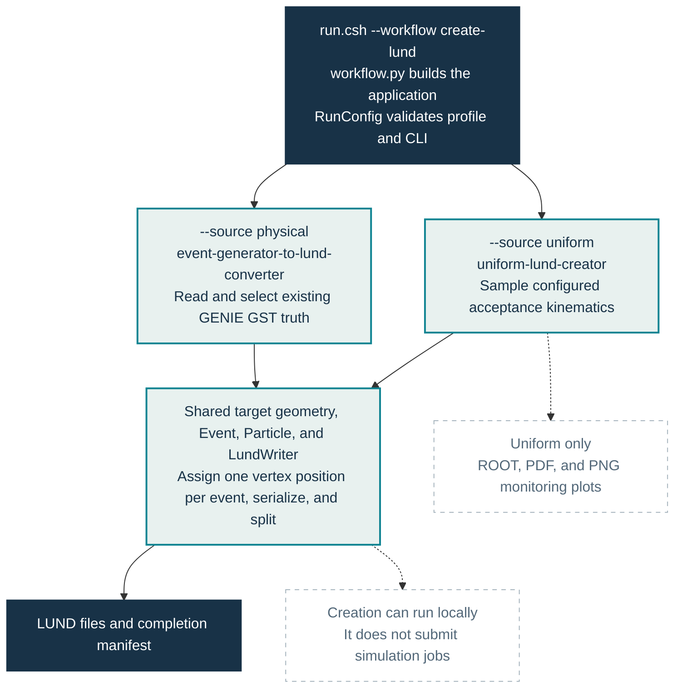

# Create LUND files

The `create-lund` workflow has one common output contract and two event sources.

```mermaid
flowchart TD
    BUILD["run.csh --workflow create-lund<br/>workflow.py builds the application<br/>RunConfig validates profile and CLI"]
    U["--source uniform<br/>uniform-lund-creator<br/>Sample configured acceptance kinematics"]
    P["--source physical<br/>event-generator-to-lund-converter<br/>Read and select existing GENIE GST truth"]
    SHARED["Shared target geometry, Event, Particle, and LundWriter<br/>Assign one vertex position per event, serialize, and split"]
    DONE["LUND files and completion manifest"]
    MONITORING["Uniform only<br/>ROOT, PDF, and PNG monitoring plots"]
    LOCAL["Creation can run locally<br/>It does not submit simulation jobs"]

    BUILD --> U
    BUILD --> P
    U --> SHARED
    P --> SHARED
    SHARED --> DONE
    U -.-> MONITORING
    SHARED -.-> LOCAL

    classDef endpoint fill:#183247,color:#ffffff,stroke:#183247,stroke-width:2px;
    classDef stage fill:#e8f1ef,color:#183247,stroke:#0f8492,stroke-width:2px;
    classDef note fill:#ffffff,color:#536879,stroke:#a6b4bd,stroke-dasharray:5 5;
    class BUILD,DONE endpoint;
    class U,P,SHARED stage;
    class MONITORING,LOCAL note;
```

Code shown in the diagram: [`run.csh`](../../run.csh), [`workflow.py`](../../src/launcher/workflow.py), [`RunConfig.h`](../../src/workflows/lund-creation/core/config/RunConfig.h), and [`LundWriter.h`](../../src/workflows/lund-creation/core/lund/LundWriter.h).

## Choose a source

| Source | Use it for | Guide |
| --- | --- | --- |
| `uniform` | Deliberately unphysical acceptance samples | [Uniform samples](uniform.md) |
| `physical` | Conversion of existing event-generator truth | [Physical conversion](physical.md) |

Both sources share validated configuration, target sampling, particle records, LUND serialization, output naming, file splitting, provenance, and completion behavior where their semantics agree. They do not share event-content rules: uniform mode creates particles, while a physical adapter copies supported truth and must not invent missing kinematics.

During event writing, an interactive terminal shows one dynamically refreshed progress bar. Redirected output and batch logs receive occasional complete progress lines instead of carriage-return animation. Both sources calculate completion from written/requested events. Physical conversion also reports scanned/total GST input entries because rejected interactions and the submission-tail cutoff mean those two counts can advance differently. The final progress line states why the physical scan stopped; it can finish below 100% when input exhaustion or the submission-tail cutoff prevents the requested number of events from being written.

## Output replacement and completion

Before writing, either source reports the fully resolved run directory. If that directory already exists, the workflow warns, recursively removes that exact directory, and recreates it. Review the reported path before using a production output location. Both sources prepare empty `mchipo/` and `reconhipo/` directories beside `lundfiles/` for the later simulation workflow.

A successful run publishes `lundfiles/lund-creation-monitoring/lund-creation-log.json` last. This manifest records the resolved settings, software provenance, scanned and written event counts, and exact LUND file inventory. A failed or interrupted run may leave partial output for inspection, but it does not publish the manifest and is not ready for submission. See [Outputs and completion](../getting-started/outputs.md) for the directory layout and [the LUND data contract](../concepts/lund-data-contract.md) for manifest fields.

## Pages in this section

- [Configuration reference](configuration.md): all shared and source-specific settings.
- [Command examples](examples.md): profiles, overrides, build controls, and physical provenance.
- [Uniform monitoring](monitoring.md): ROOT objects and rendered products.
- [Sample profile inventory](../../config/samples/README.md): reviewed beam/channel configurations.
- [LUND data contract](../concepts/lund-data-contract.md): serialized fields, splitting, and manifest schema.
- [Targets, seeds, and sampling](../concepts/sampling-models.md): scientific definitions and reproducibility.

Creating LUND files never submits simulation. Continue with [Submit simulation](../submit-simulation/index.md) only after a run has a completion manifest.
