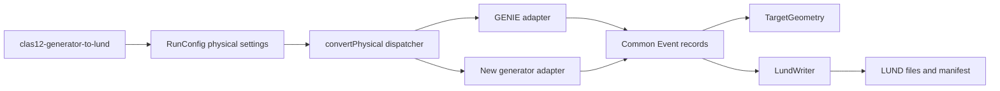

# Adding another event-generator-to-LUND adapter

Add a generator as a small adapter behind the existing `clas12-generator-to-lund` executable. Do not create a new top-level workflow or duplicate target sampling, LUND formatting, output naming, manifests, or completion behavior.



## 1. Define the adapter boundary

Create a directory beneath `src/lund-generation/clas12-generator-to-lund/`, for example:

```text
src/lund-generation/clas12-generator-to-lund/
└── mygenerator/
    ├── MyGeneratorConverter.h
    └── MyGeneratorConverter.cpp
```

Expose one synchronous function that borrows the resolved configuration:

```cpp
namespace samples {

/**
 * @brief Convert supported MyGenerator truth records into completed LUND output.
 * @param config Resolved physical-source configuration borrowed for this call.
 * @throws std::exception For invalid input/schema, unsupported-only input, or output failure.
 */
void convertMyGenerator(const RunConfig& config);

}  // namespace samples
```

Document the input schema, accepted processes and particles, ordering, metadata mapping, units, assumptions, ownership, and failure behavior. The public executable remains `clas12-generator-to-lund --event-generator mygenerator`.

## 2. Validate before accessing records

The adapter owns generator-specific input validation. Check files, trees/records, types, array lengths, required metadata, and cross-field consistency before indexed access. Reject malformed input instead of partially guessing its meaning. If no supported events are written, fail without publishing a completion manifest.

Physical conversion must copy available truth. It must not resample particle momenta, manufacture missing decay products, or silently reinterpret generator weights/process identifiers. Document every supported and skipped category.

## 3. Translate into the common event model

The adapter should follow this shape while substituting its real reader and source semantics:

```cpp
void convertMyGenerator(const RunConfig& config) {
    config.validate(false);
    LundWriter::printWorkflowSummary(config, "physical");

    TargetGeometry geometry(config.get("target"));
    TRandom3 vertex_random(config.integer("vertex-seed"));
    LundWriter writer(config, "physical");
    std::uint64_t scanned = 0;

    MyGeneratorReader reader(config.get("input"));

    while (!writer.full() && reader.next()) {
        ++scanned;

        if (!supportedInteraction(reader)) {
            continue;
        }

        Event event;
        event.id = reader.sourceIndex();
        event.A = static_cast<int>(config.integer("A"));
        event.Z = static_cast<int>(config.integer("Z"));
        event.beam_energy = config.number("beam-energy");
        event.resonance_id = sourceHeaderMetadata(reader);
        event.weight = sourceProcessCode(reader);

        const auto vertex = geometry.sample(vertex_random);

        for (const auto& truth : supportedParticles(reader)) {
            event.particles.push_back(
                {truth.pdg, particleMass(truth.pdg), truth.momentum, vertex});
        }

        writer.write(event);
    }

    if (!writer.count()) { throw std::runtime_error("No supported MyGenerator events in input"); }

    writer.finish(scanned);
    LundWriter::printWorkflowSummary(config, "physical", scanned, writer.count(), true);
}
```

The example is architectural, not a copy-ready reader. `supportedParticles` must preserve the documented source order, and every particle in one event must receive the same single sampled vertex. Use `particleMass()` so supported masses continue to come from the protected target source. Physical adapters create no uniform monitoring histograms.

## 4. Decide source-specific header semantics

Document and test how the generator maps into:

- event identifier and ordering;
- nuclear A/Z metadata versus target geometry;
- beam energy;
- header field 4 metadata;
- final header field process/weight semantics;
- retained/skipped PDG identities;
- upstream-decay requirements;
- scanned, rejected, and written counts.

Do not copy GENIE's `resid` or QE/MEC/RES/DIS mapping unless the new source has the same scientifically justified meaning.

## 5. Register configuration and dispatch

Update the physical branch of `RunConfig` so `event-generator=mygenerator` is accepted. Add only genuinely required generator-specific settings; keep shared input, target, output, capacity, splitting, and provenance keys common. Update the command-line help and a checked-in sample profile with explicit metadata.

Include the adapter in `PhysicalConverter.cpp` and add one direct branch:

```cpp
if (config.get("event-generator") == "mygenerator") {
    convertMyGenerator(config);
    return;
}
```

The explicit dispatcher is intentional. Do not introduce a registry or plugin lifecycle for this small supported set.

## 6. Add build integration

Create a source-specific library in `src/lund-generation/CMakeLists.txt`, link only its required parser/runtime dependencies, and link it privately into `PhysicalConversion`. Keep generator libraries out of `LundCore` so uniform-only builds do not acquire unrelated dependencies.

If the adapter needs a new optional build switch, document its interaction with the existing physical executable and ensure the executable is not built with a dispatcher branch whose adapter library is absent.

## 7. Preserve splitting and provenance

`LundWriter` owns successful-event capacity, file rotation, serialization, guarded output replacement, and manifest publication. The adapter owns input traversal and rejection counts. If the input has a finite entry inventory and must align follow-up files with `JOB_NEVENTS`, implement and test the documented inclusive remaining-input cutoff or extract the common policy without changing GENIE behavior.

Physical output naming already includes event-generator name/version, tune, Q²/input-selection label, beam energy, target variation, and GEMC version. Use explicit `none` or `unknown` tokens when a field does not apply; preserve the original unsanitized values in the manifest.

## 8. Test the adapter

Add a small deterministic fixture and integration cases covering:

- every retained process and particle species;
- stable particle ordering and one shared vertex;
- malformed/missing types and inconsistent arrays;
- skipped processes/species and unsupported-only input;
- capacity, rollover, short final input, and exact-block boundaries;
- input failure in a later chained file;
- manifest scanned/written/per-file counts and provenance;
- absence of physical monitoring ROOT/PDF/PNG output;
- failure without a completed manifest.

Update [validation](validation.md), the [physical conversion guide](../create-lund/physical.md), [configuration](../create-lund/configuration.md), [source reference](source-reference.md), and relevant examples in the same change.
