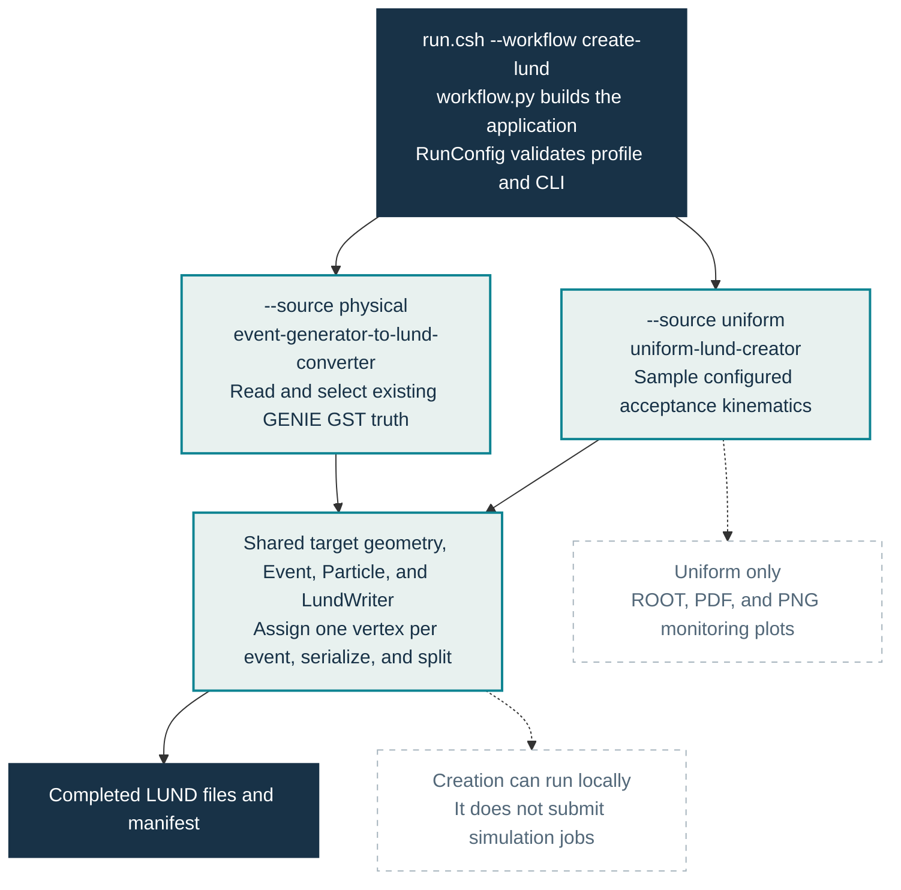
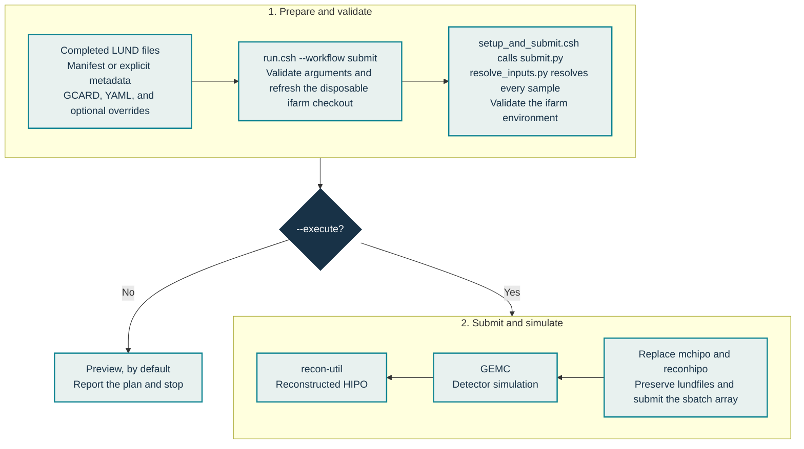

# CLAS12 sample generator documentation

This project has exactly two user-facing workflows. First create completed LUND files from uniform acceptance sampling or existing physical event-generator truth. Later, and only as a separate action, submit those LUND files to ifarm Slurm for GEMC detector simulation followed by CLAS12 reconstruction.

## 1. Create LUND files

Code shown in the diagram: [`run.csh`](../run.csh), [`workflow.py`](../src/launcher/workflow.py), [`RunConfig.h`](../src/lund-generation/core/config/RunConfig.h), and [`LundWriter.h`](../src/lund-generation/core/lund/LundWriter.h).

See [Create LUND files](create-lund/index.md) for configuration, source-specific behavior, examples, and output contracts.

## 2. Submit and simulate

Code shown in the diagram: [`run.csh`](../run.csh), [`setup_and_submit.csh`](../src/slurm-submission/setup_and_submit.csh), [`submit.py`](../src/slurm-submission/submit.py), and [`resolve_inputs.py`](../src/slurm-submission/resolve_inputs.py).

See [Submit simulation](submit-simulation/index.md) for preview, execution, environment, and worker details.

Submission responsibility ends when `sbatch` accepts the array. The project does not monitor later Slurm task failures or validate reconstructed output. After the jobs finish, inspect the scheduler and job logs and use `hipo-utils -dump` on at least one file in `RUN/reconhipo/` to confirm that readable CLAS12 data banks are present.

The project does not run a physical event generator, derive acceptance maps, or perform physics analysis.

## Choose where to start

| Goal | Start here |
| --- | --- |
| Build the project and make a small sample | [Getting started](getting-started/index.md) |
| Create uniform or physical LUND files | [Create LUND files](create-lund/index.md) |
| Submit completed LUND files to ifarm | [Submit simulation](submit-simulation/index.md) |
| Understand sampling, records, architecture, or provenance | [Concepts and data contracts](concepts/index.md) |
| Modify or extend the software | [Development guide](development/index.md) |
| Understand compatibility and archived behavior | [History and migration](history/index.md) |

## Common reader paths

- **New user:** [install and build](getting-started/installation.md) → [quickstart](getting-started/quickstart.md) → [output layout](getting-started/outputs.md).
- **Uniform-sample user:** [creation overview](create-lund/index.md) → [uniform sampling](create-lund/uniform.md) → [examples](create-lund/examples.md).
- **Physical-sample user:** [creation overview](create-lund/index.md) → [physical conversion](create-lund/physical.md) → [examples](create-lund/examples.md).
- **ifarm operator:** [submission overview](submit-simulation/index.md) → [examples](submit-simulation/examples.md) → [full operational guide](submit-simulation/guide.md).
- **Adapter developer:** [architecture](concepts/architecture.md) → [adding an event generator](development/adding-event-generator.md) → [scientific validation boundaries](development/validation.md).

## Safety and provenance

LUND creation reports the fully resolved run directory, then recursively replaces that exact directory when it already exists. Submission previews by default; `--execute` replaces simulation output directories while preserving LUND input. The ifarm checkout is intentionally disposable and is refreshed from Git before a real workflow. Read the relevant workflow page before using production paths.

Every successful LUND run publishes `lundfiles/lund-gen-monitoring/lund-gen-log.json`. That manifest is the handoff from creation to submission and records resolved settings, software provenance, scanned/written counts, and the exact LUND file inventory.
