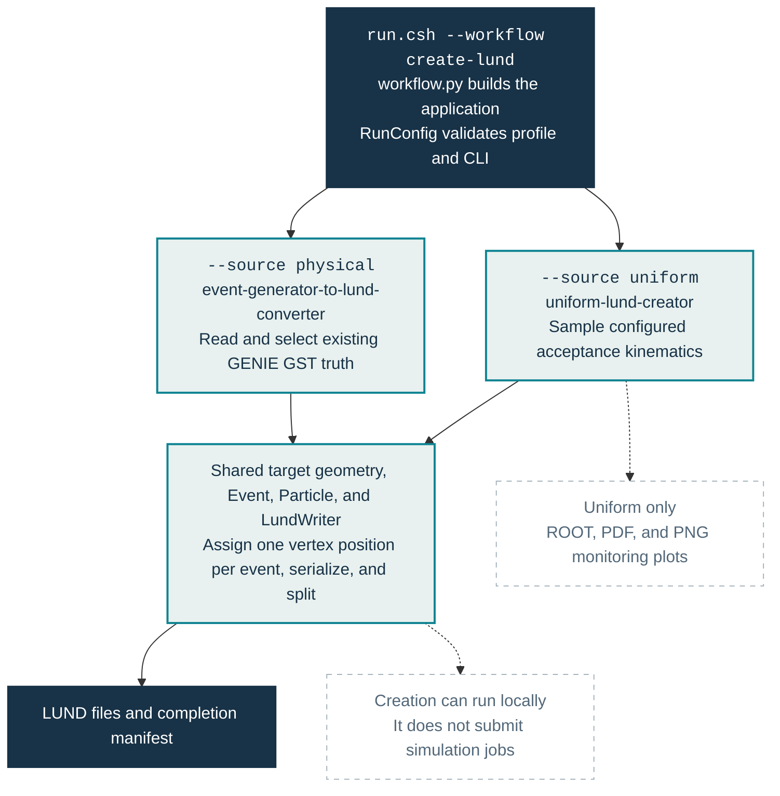
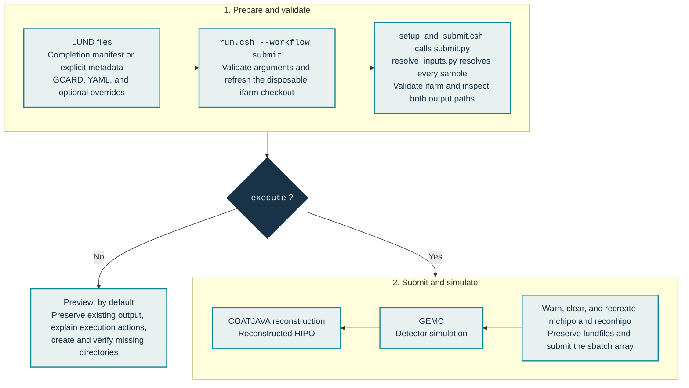

# CLAS12 sample generator documentation

This project prepares simulation samples for the [e4ν collaboration](https://e4nu.org)'s electron-scattering studies with the CLAS12 spectrometer[^clas12-spectrometer] at Jefferson Lab. It currently has two user-facing workflows. First, create [LUND files](https://gemc.jlab.org/gemc/html/documentation/generator/lund.html) from deliberately unphysical uniform acceptance sampling or existing physical event-generator truth-level output. The physical LUND converter currently supports [GENIE](https://github.com/GENIE-MC/Generator) GST input; its adapter boundary allows other event-generator formats to be added. When creation succeeds, it publishes `lund-creation-log.json`, which records the exact LUND file inventory, event counts, resolved settings, and provenance and marks the run as ready for submission. In the second workflow, the user can submit that run's `lundfiles/` directory to ifarm Slurm for GEMC[^gemc-simulation] detector simulation followed by CLAS12 reconstruction with COATJAVA[^coatjava-reconstruction]. Future downstream workflows will join these as peers when they are implemented.

## 1. The LUND file creation workflow

```mermaid
flowchart TD
    BUILD["<code>run.csh --workflow create-lund</code><br/>workflow.py builds the application<br/>RunConfig validates profile and CLI"]
    U["<code>--source uniform</code><br/>uniform-lund-creator<br/>Sample configured acceptance kinematics"]
    P["<code>--source physical</code><br/>event-generator-to-lund-converter<br/>Read and select existing GENIE GST truth"]
    SHARED["Shared target geometry, Event, Particle, and LundWriter<br/>Assign one vertex position per event, serialize, and split"]
    DONE["LUND files and completion manifest"]
    MONITORING["Uniform only<br/>ROOT, PDF, and PNG monitoring plots"]
    LOCAL["Creation can run locally<br/>It does not submit simulation jobs"]

    BUILD --> U
    BUILD --> P
    U --> SHARED
    P --> SHARED
    SHARED --> DONE
    U -.-> MONITORING
    SHARED -.-> LOCAL

    classDef endpoint fill:#183247,color:#ffffff,stroke:#183247,stroke-width:2px;
    classDef stage fill:#e8f1ef,color:#183247,stroke:#0f8492,stroke-width:2px;
    classDef note fill:#ffffff,color:#536879,stroke:#a6b4bd,stroke-dasharray:5 5;
    class BUILD,DONE endpoint;
    class U,P,SHARED stage;
    class MONITORING,LOCAL note;
```

**Code shown in the diagram:** [`run.csh`](../run.csh), [`workflow.py`](../src/launcher/workflow.py), [`RunConfig.h`](../src/workflows/lund-creation/core/config/RunConfig.h), and [`LundWriter.h`](../src/workflows/lund-creation/core/lund/LundWriter.h).

See [Create LUND files](create-lund/index.md) for configuration, source-specific behavior, examples, and output contracts.

## 2. The Slurm submission workflow

```mermaid
flowchart TB
    subgraph PREPARE["1. Prepare and validate"]
        direction LR
        INPUTS["LUND files<br/>Completion manifest or explicit metadata<br/>GCARD, YAML, and optional overrides"] --> ENTRY["<code>run.csh --workflow submit</code><br/>Validate arguments and refresh the disposable ifarm checkout"]
        ENTRY --> VALIDATE["setup_and_submit.csh calls submit.py<br/>resolve_inputs.py resolves every sample<br/>Validate ifarm and inspect both output paths"]
    end

    EXECUTE{"<code>--execute</code> ?"}
    PREVIEW["Preview, by default<br/>Preserve existing output, explain execution actions,<br/>create and verify missing directories"]

    subgraph SIMULATE["2. Submit and simulate"]
        direction RL
        SUBMIT["Warn, clear, and recreate mchipo and reconhipo<br/>Preserve lundfiles and submit the sbatch array"] --> GEMC["GEMC<br/>Detector simulation"]
        GEMC --> RECON["COATJAVA reconstruction<br/>Reconstructed HIPO"]
    end

    PREPARE --> EXECUTE
    EXECUTE -->|No| PREVIEW
    EXECUTE -->|Yes| SIMULATE

    classDef decision fill:#183247,color:#ffffff,stroke:#183247,stroke-width:2px;
    classDef stage fill:#e8f1ef,color:#183247,stroke:#0f8492,stroke-width:2px;
    class EXECUTE decision;
    class INPUTS,ENTRY,VALIDATE,PREVIEW,SUBMIT,GEMC,RECON stage;
```

**Code shown in the diagram:** [`run.csh`](../run.csh), [`setup_and_submit.csh`](../src/workflows/slurm-submission/setup_and_submit.csh), [`submit.py`](../src/workflows/slurm-submission/submit.py), and [`resolve_inputs.py`](../src/workflows/slurm-submission/resolve_inputs.py).

See [Submit simulation](submit-simulation/index.md) for preview, execution, environment, and worker details. The project does not run a physical event generator, derive acceptance maps, or perform physics analysis.

**Note:** Submission responsibility ends when `sbatch` accepts the array. The project does not monitor later Slurm task failures or validate reconstructed output. After the jobs finish, inspect the scheduler and job logs and use `hipo-utils -dump <HIPO filename>.hipo` on at least one file in `RUN/reconhipo/` to confirm that readable CLAS12 data banks are present.

## Choose where to start

| Goal | Start here |
| --- | --- |
| Build the project and make a small sample | [Getting started](getting-started/index.md) |
| Create uniform or physical LUND files | [Create LUND files](create-lund/index.md) |
| Submit a LUND run to ifarm | [Submit simulation](submit-simulation/index.md) |
| Understand sampling, records, architecture, or provenance | [Concepts and data contracts](concepts/index.md) |
| Modify or extend the software | [Contributing](development/contributing.md) and the [Development guide](development/index.md) |

## Common reader paths

- **New user:** [dependencies and build paths](getting-started/installation.md) → [quickstart](getting-started/quickstart.md) → [output layout](getting-started/outputs.md).
- **Uniform-sample user:** [creation overview](create-lund/index.md) → [uniform sampling](create-lund/uniform.md) → [examples](create-lund/examples.md).
- **Physical-sample user:** [creation overview](create-lund/index.md) → [physical conversion](create-lund/physical.md) → [examples](create-lund/examples.md).
- **ifarm operator:** [submission overview](submit-simulation/index.md) → [examples](submit-simulation/examples.md) → [full operational guide](submit-simulation/guide.md).
- **Adapter developer:** [architecture](concepts/architecture.md) → [adding an event generator](development/adding-event-generator.md) → [scientific validation boundaries](development/validation.md).
- **Contributor:** [contribution guide](development/contributing.md) → [source reference](development/source-reference.md) → [validation boundaries](development/validation.md).

[^clas12-spectrometer]: V. D. Burkert et al., “The CLAS12 Spectrometer at Jefferson Laboratory,” *Nucl. Instrum. Meth. A* **959**, 163419 (2020). [doi:10.1016/j.nima.2020.163419](https://doi.org/10.1016/j.nima.2020.163419)

[^gemc-simulation]: M. Ungaro et al., “The CLAS12 Geant4 simulation,” *Nucl. Instrum. Meth. A* **959**, 163422 (2020). [doi:10.1016/j.nima.2020.163422](https://doi.org/10.1016/j.nima.2020.163422)

[^coatjava-reconstruction]: V. Ziegler et al., “The CLAS12 software framework and event reconstruction,” *Nucl. Instrum. Meth. A* **959**, 163472 (2020). [doi:10.1016/j.nima.2020.163472](https://doi.org/10.1016/j.nima.2020.163472)
