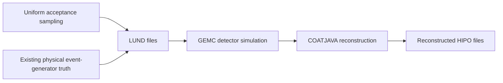

# CLAS12 sample generator documentation

This project prepares truth-level particle samples and sends them through the CLAS12[^clas12-spectrometer] detector-simulation chain used by the e4ν collaboration. It makes the boundary between event preparation and detector processing explicit:

```mermaid
flowchart LR
    U["Uniform acceptance sampling"] --> L["LUND files"]
    P["Existing physical event-generator truth"] --> L
    L --> G["GEMC detector simulation"]
    G --> R["COATJAVA reconstruction"]
    R --> H["Reconstructed HIPO files"]
```

The **uniform LUND creator** samples configured kinematics for detector-acceptance studies. These events are deliberately unphysical. The **physical LUND converter** copies supported truth-level particles from an existing input; the current adapter reads [GENIE](https://github.com/GENIE-MC/Generator) GST [ROOT](https://github.com/root-project/root) trees and does not run GENIE. A successful creation run publishes a manifest that records its settings, provenance, event counts, and exact LUND file inventory.

The separate submission workflow consumes those LUND files on Jefferson Lab's ifarm. Each Slurm task runs GEMC[^gemc-simulation], then runs CLAS12 reconstruction through COATJAVA's `recon-util` command.[^coatjava-reconstruction] The result is reconstructed [HIPO](https://github.com/gavalian/hipo) data, which can be analyzed with [CLAS12ROOT](https://github.com/JeffersonLab/clas12root/tree/master). The project hands the array to Slurm but does not monitor it to completion or perform that downstream analysis.

## Reading order

If you want to run the software:

1. [Dependencies and execution environments](getting-started/installation.md)
2. [Quickstart](getting-started/quickstart.md)
3. [Create LUND files](create-lund/index.md), followed by either the [uniform](create-lund/uniform.md) or [physical](create-lund/physical.md) guide
4. [Submit simulation](submit-simulation/index.md)
5. [Run directories and outputs](getting-started/outputs.md)

If you want to modify or extend the software:

1. [Architecture](concepts/architecture.md)
2. [Source and API map](development/source-reference.md)
3. [Data contract](concepts/lund-data-contract.md) and [sampling model](concepts/sampling-models.md)
4. [Contributing and validation](development/contributing.md)
5. [Adding another physical-input adapter](development/adding-event-generator.md), when relevant

Use the [workflow command examples](../tutorials/README.md) as a copyable option inventory, not as a substitute for understanding the selected profile and output path.

## Scope

The repository currently implements only LUND creation and ifarm simulation submission. Acceptance calculation, reconstructed-HIPO skimming, analysis-NTuple creation, and physics analysis are downstream work. When one of those becomes implemented, it should enter the source tree as a peer workflow with its own input, output, and configuration contract.

The long-form Wiki is generated from this repository. Edit these source files, not the published Wiki. Internal development notes, publication planning, and historical comparisons are intentionally excluded.

[^clas12-spectrometer]: V. D. Burkert et al., “The CLAS12 Spectrometer at Jefferson Laboratory,” *Nucl. Instrum. Meth. A* **959**, 163419 (2020). [doi:10.1016/j.nima.2020.163419](https://doi.org/10.1016/j.nima.2020.163419)

[^gemc-simulation]: M. Ungaro et al., “The CLAS12 Geant4 simulation,” *Nucl. Instrum. Meth. A* **959**, 163422 (2020). [doi:10.1016/j.nima.2020.163422](https://doi.org/10.1016/j.nima.2020.163422)

[^coatjava-reconstruction]: V. Ziegler et al., “The CLAS12 software framework and event reconstruction,” *Nucl. Instrum. Meth. A* **959**, 163472 (2020). [doi:10.1016/j.nima.2020.163472](https://doi.org/10.1016/j.nima.2020.163472)
