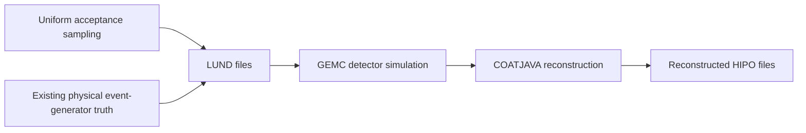

# CLAS12 sample generator documentation

This project prepares simulation samples for the [e4ν collaboration](https://e4nu.org) using the CLAS12 spectrometer[^clas12-spectrometer] simulation chain. It provides separate workflows for preparing truth-level particles and submitting detector simulation and reconstruction.

Neutrino oscillation experiments infer the incident neutrino energy from the particles measured after a neutrino interacts with a nucleus, so uncertainties in nuclear-interaction models can distort the reconstructed energy distribution. Electron beams instead provide a precise, known incident energy, while electron- and neutrino-nucleus scattering share the same nuclear ground state and many reaction and final-state effects. Electron-scattering data can therefore constrain the vector-current part of neutrino-interaction models and their energy-reconstruction performance[^electrons-for-neutrinos][^electron-beam-energy-reconstruction].

The first workflow writes particles before detector simulation, called truth-level particles, to [LUND text files](https://gemc.jlab.org/gemc/html/documentation/generator/lund.html). The **uniform LUND creator** randomly chooses momenta and angles within your configured ranges, producing deliberately unphysical events for detector-acceptance studies. The **physical LUND converter** copies supported particles from existing event-generator output. Its current input reader uses [GENIE](https://github.com/GENIE-MC/Generator) GST (generator summary tree) data stored in [ROOT](https://github.com/root-project/root) files; it does not run GENIE. After creation succeeds, it writes a completion manifest: a JSON log listing the sample settings, files, and event counts.

The second workflow submits those LUND files to Slurm on Jefferson Lab's ifarm. Each task runs GEMC detector simulation[^gemc-simulation], followed by CLAS12 reconstruction with COATJAVA[^coatjava-reconstruction]. The result is reconstructed [HIPO](https://github.com/gavalian/hipo) data, which can be analyzed with [CLAS12ROOT](https://github.com/JeffersonLab/clas12root/tree/master).

The diagram summarizes the path from event preparation to reconstructed output. Creation and submission are separate user actions:

```mermaid
flowchart LR
    U["Uniform acceptance sampling"] --> L["LUND files"]
    P["Existing physical event-generator truth"] --> L
    L --> G["GEMC detector simulation"]
    G --> R["COATJAVA reconstruction"]
    R --> H["Reconstructed HIPO files"]
```

## Reading order

If you want to run the software:

Follow the [getting-started reading path](getting-started/index.md): dependencies, quickstart, run directories and outputs, the selected LUND-creation guide, then simulation submission and output verification. Read the output layout immediately after the quickstart so you know which directory to pass to submission.

If you want to modify or extend the software:

Follow the [developer reading path](development/index.md). It starts with architecture and the source map, explains the scientific and data contracts, then covers contribution, builds, validation, and specific extensions. First read the user guide for the workflow you intend to change.

Use the [workflow command examples](../tutorials/README.md) as a copyable option inventory, not as a substitute for understanding the selected profile and output path.

## Scope

The repository currently creates LUND files and submits ifarm simulation jobs. The submission command returns when Slurm accepts the jobs; users must then follow their progress and check the output. It does not calculate acceptance, select events from reconstructed HIPO files (skimming), create analysis NTuples, or perform physics analysis. If these tasks are added later, each needs a separate workflow directory with documented inputs, outputs, and settings.

[^clas12-spectrometer]: V. D. Burkert et al., “The CLAS12 Spectrometer at Jefferson Laboratory,” *Nucl. Instrum. Meth. A* **959**, 163419 (2020). [doi:10.1016/j.nima.2020.163419](https://doi.org/10.1016/j.nima.2020.163419)

[^gemc-simulation]: M. Ungaro et al., “The CLAS12 Geant4 simulation,” *Nucl. Instrum. Meth. A* **959**, 163422 (2020). [doi:10.1016/j.nima.2020.163422](https://doi.org/10.1016/j.nima.2020.163422)

[^coatjava-reconstruction]: V. Ziegler et al., “The CLAS12 software framework and event reconstruction,” *Nucl. Instrum. Meth. A* **959**, 163472 (2020). [doi:10.1016/j.nima.2020.163472](https://doi.org/10.1016/j.nima.2020.163472)

[^electrons-for-neutrinos]: A. Papadopoulou et al. (electrons for neutrinos Collaboration), “Inclusive Electron Scattering And The GENIE Neutrino Event Generator,” *Phys. Rev. D* **103**, 113003 (2021). [doi:10.1103/PhysRevD.103.113003](https://doi.org/10.1103/PhysRevD.103.113003)

[^electron-beam-energy-reconstruction]: M. Khachatryan et al. (CLAS and e4ν Collaborations), “Electron-beam energy reconstruction for neutrino oscillation measurements,” *Nature* **599**, 565–570 (2021). [doi:10.1038/s41586-021-04046-5](https://doi.org/10.1038/s41586-021-04046-5)
