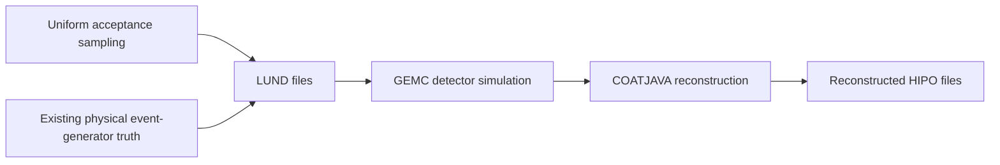

# CLAS12 sample generator documentation

This project prepares simulation samples for the e4ν collaboration using the CLAS12 spectrometer[^clas12-spectrometer] simulation chain. It provides separate workflows for preparing truth-level particles and submitting detector simulation and reconstruction.

Neutrino oscillation experiments infer the incident neutrino energy from the particles measured after a neutrino interacts with a nucleus, so uncertainties in nuclear-interaction models can distort the reconstructed energy distribution. Electron beams instead provide a precise, known incident energy, while electron- and neutrino-nucleus scattering share the same nuclear ground state and many reaction and final-state effects. Electron-scattering data can therefore constrain the vector-current part of neutrino-interaction models and their energy-reconstruction performance[^electrons-for-neutrinos][^electron-beam-energy-reconstruction].

The first workflow creates [LUND files](https://gemc.jlab.org/gemc/html/documentation/generator/lund.html), used as the generated event input to CLAS12's simulation chain. The **uniform LUND creator** samples configured kinematics for detector-acceptance studies. These events are deliberately unphysical. The **physical LUND converter** copies supported truth-level particles from existing event-generator output; the current adapter reads [ROOT](https://github.com/root-project/root) trees in the [GENIE](https://github.com/GENIE-MC/Generator) GST format and does not run GENIE. Successful creation produces LUND files and a completion manifest.

The second workflow submits those LUND files to Slurm on Jefferson Lab's ifarm. Each task runs GEMC detector simulation[^gemc-simulation], followed by CLAS12 reconstruction with COATJAVA[^coatjava-reconstruction]. The result is reconstructed [HIPO](https://github.com/gavalian/hipo) data, which can be analyzed with [CLAS12ROOT](https://github.com/JeffersonLab/clas12root/tree/master).

The diagram summarizes the path from event preparation to reconstructed output. Creation and submission are separate user actions:

```mermaid
flowchart LR
    U["Uniform acceptance sampling"] --> L["LUND files"]
    P["Existing physical event-generator truth"] --> L
    L --> G["GEMC detector simulation"]
    G --> R["COATJAVA reconstruction"]
    R --> H["Reconstructed HIPO files"]
```

## Reading order

If you want to run the software:

1. [Dependencies and execution environments](getting-started/installation.md)
2. [Quickstart](getting-started/quickstart.md)
3. [Create LUND files](create-lund/index.md), followed by either the [uniform](create-lund/uniform.md) or [physical](create-lund/physical.md) guide
4. [Submit simulation](submit-simulation/index.md)
5. [Run directories and outputs](getting-started/outputs.md)

If you want to modify or extend the software:

1. [Architecture](concepts/architecture.md)
2. [Source and API map](development/source-reference.md)
3. [Data contract](concepts/lund-data-contract.md) and [sampling model](concepts/sampling-models.md)
4. [Contributing and validation](development/contributing.md)
5. [Adding another physical-input adapter](development/adding-event-generator.md), when relevant

Use the [workflow command examples](../tutorials/README.md) as a copyable option inventory, not as a substitute for understanding the selected profile and output path.

## Scope

The repository currently implements LUND creation and ifarm simulation submission. Submission ends when Slurm accepts the jobs; users then follow their progress and inspect the output. Acceptance calculation, reconstructed-HIPO skimming, analysis-NTuple creation, and physics analysis are downstream work. Future implementations belong in separate peer workflows with their own input, output, and configuration contracts.

[^clas12-spectrometer]: V. D. Burkert et al., “The CLAS12 Spectrometer at Jefferson Laboratory,” *Nucl. Instrum. Meth. A* **959**, 163419 (2020). [doi:10.1016/j.nima.2020.163419](https://doi.org/10.1016/j.nima.2020.163419)

[^gemc-simulation]: M. Ungaro et al., “The CLAS12 Geant4 simulation,” *Nucl. Instrum. Meth. A* **959**, 163422 (2020). [doi:10.1016/j.nima.2020.163422](https://doi.org/10.1016/j.nima.2020.163422)

[^coatjava-reconstruction]: V. Ziegler et al., “The CLAS12 software framework and event reconstruction,” *Nucl. Instrum. Meth. A* **959**, 163472 (2020). [doi:10.1016/j.nima.2020.163472](https://doi.org/10.1016/j.nima.2020.163472)

[^electrons-for-neutrinos]: A. Papadopoulou et al. (electrons for neutrinos Collaboration), “Inclusive Electron Scattering And The GENIE Neutrino Event Generator,” *Phys. Rev. D* **103**, 113003 (2021). [doi:10.1103/PhysRevD.103.113003](https://doi.org/10.1103/PhysRevD.103.113003)

[^electron-beam-energy-reconstruction]: M. Khachatryan et al. (CLAS and e4ν Collaborations), “Electron-beam energy reconstruction for neutrino oscillation measurements,” *Nature* **599**, 565–570 (2021). [doi:10.1038/s41586-021-04046-5](https://doi.org/10.1038/s41586-021-04046-5)
