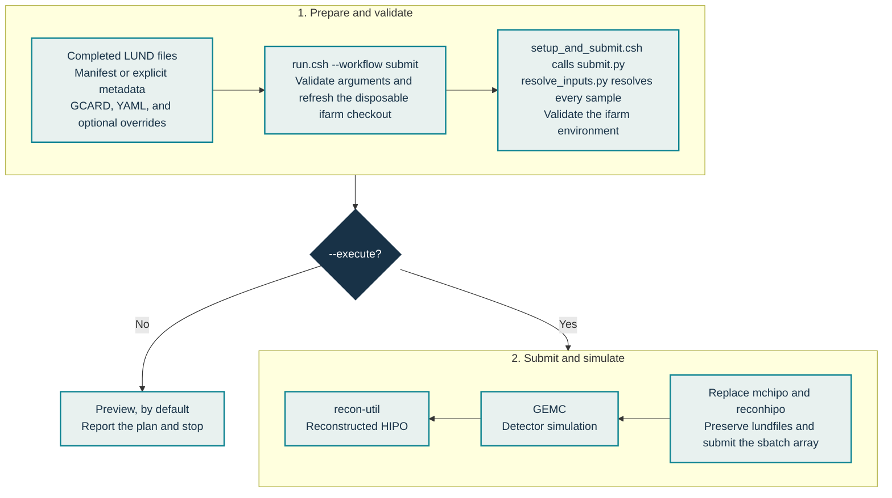

# Submit GEMC and reconstruction jobs

This workflow consumes completed LUND output and submits one ifarm Slurm array. It does not create LUND files and it is not a local detector-simulation workflow.



Code shown in the diagram: [`run.csh`](../../run.csh), [`setup_and_submit.csh`](../../src/workflows/slurm-submission/setup_and_submit.csh), [`submit.py`](../../src/workflows/slurm-submission/submit.py), and [`resolve_inputs.py`](../../src/workflows/slurm-submission/resolve_inputs.py).

## Normal path

1. Start with the [submission examples](examples.md) and preview without `--execute`.
2. Read the [full operational guide](guide.md) before production submission.
3. Use the [ifarm environment guide](ifarm-environment.md) for the disposable checkout and module behavior.
4. Consult the [worker reference](worker-reference.md) only when maintaining detector-command integration.

The manifest normally supplies truth metadata, prefix, file inventory, event counts, and detector defaults. Resolution precedence is CLI → optional submission config → manifest → safe fallback defaults. Explicit truth metadata that conflicts with a completed manifest is rejected.

## Verify jobs after submission

After `sbatch` accepts an array, the coordinator prints its numeric `SLURM_JOB_ID` and saves that value in `reconhipo/slurm-submission-log.json`. It then stops accounting for the job: it does not poll later task states, detect or retry failed array tasks, or validate the HIPO files produced by GEMC and reconstruction. An accepted submission therefore does not guarantee that every task completed successfully. The complete workflow invocation uses the same shared success and stop artwork as LUND creation.

After the array finishes, inspect its Slurm state and job logs, confirm the expected output inventory, and dump at least one reconstructed file:

```text
hipo-utils -dump RUN/reconhipo/<hipo-file-name>.hipo
```

Confirm that the file opens and displays CLAS12 data banks. This is a required smoke test, but one valid file does not establish that every array task succeeded; review the remaining task states, logs, and output files as well.
