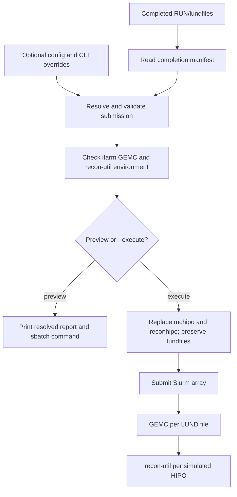

# Submit GEMC and reconstruction jobs

This workflow consumes completed LUND output and submits one ifarm Slurm array. It does not create LUND files and it is not a local detector-simulation workflow.

## Normal path

1. Start with the [submission examples](examples.md) and preview without `--execute`.
2. Read the [full operational guide](guide.md) before production submission.
3. Use the [ifarm environment guide](ifarm-environment.md) for the disposable checkout and module behavior.
4. Consult the [worker reference](worker-reference.md) only when maintaining detector-command integration.

The manifest normally supplies truth metadata, prefix, file inventory, event counts, and detector defaults. Resolution precedence is CLI → optional submission config → manifest → safe fallback defaults. Explicit truth metadata that conflicts with a completed manifest is rejected.
