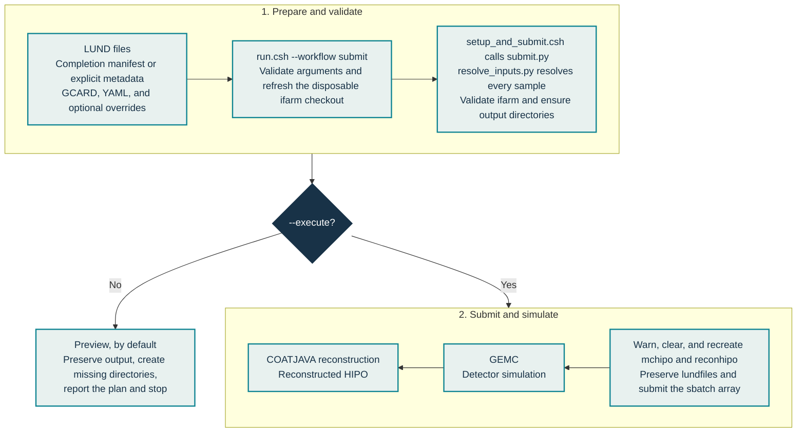

# Submit GEMC and reconstruction jobs

This workflow consumes a LUND run with a completion manifest, or explicitly described LUND input, and submits an ifarm Slurm array that runs GEMC detector simulation[^gemc-simulation] followed by CLAS12 reconstruction with COATJAVA[^coatjava-reconstruction]. It does not create LUND files and it is not a local detector-simulation workflow.


```mermaid
flowchart TB
    subgraph PREPARE["1. Prepare and validate"]
        direction LR
        INPUTS["LUND files<br/>Completion manifest or explicit metadata<br/>GCARD, YAML, and optional overrides"] --> ENTRY["run.csh --workflow submit<br/>Validate arguments and refresh the disposable ifarm checkout"]
        ENTRY --> VALIDATE["setup_and_submit.csh calls submit.py<br/>resolve_inputs.py resolves every sample<br/>Validate ifarm and ensure output directories"]
    end

    EXECUTE{"--execute?"}
    PREVIEW["Preview, by default<br/>Preserve output, create missing directories,<br/>report the plan and stop"]

    subgraph SIMULATE["2. Submit and simulate"]
        direction RL
        SUBMIT["Warn, clear, and recreate mchipo and reconhipo<br/>Preserve lundfiles and submit the sbatch array"] --> GEMC["GEMC<br/>Detector simulation"]
        GEMC --> RECON["COATJAVA reconstruction<br/>Reconstructed HIPO"]
    end

    PREPARE --> EXECUTE
    EXECUTE -->|No| PREVIEW
    EXECUTE -->|Yes| SIMULATE

    classDef decision fill:#183247,color:#ffffff,stroke:#183247,stroke-width:2px;
    classDef stage fill:#e8f1ef,color:#183247,stroke:#0f8492,stroke-width:2px;
    class EXECUTE decision;
    class INPUTS,ENTRY,VALIDATE,PREVIEW,SUBMIT,GEMC,RECON stage;
```

Code shown in the diagram: [`run.csh`](../../run.csh), [`setup_and_submit.csh`](../../src/workflows/slurm-submission/setup_and_submit.csh), [`submit.py`](../../src/workflows/slurm-submission/submit.py), and [`resolve_inputs.py`](../../src/workflows/slurm-submission/resolve_inputs.py).

## Normal path

1. Follow the [ifarm environment guide](ifarm-environment.md): keep the required `~/environment.csh`, source it from `~/.cshrc`, and log in with COATJAVA 10.0.7 available.
2. Start with the [submission examples](examples.md) and preview without `--execute`.
3. Read the [full operational guide](guide.md) before production submission.
4. Consult the [worker reference](worker-reference.md) only when maintaining detector-command integration.

The manifest normally supplies truth metadata, prefix, file inventory, event counts, and detector defaults. Resolution precedence is CLI → optional submission config → manifest → safe fallback defaults. Explicit truth metadata that conflicts with a completion manifest is rejected.

## Verify jobs after submission

After `sbatch` accepts an array, the coordinator prints its numeric `SLURM_JOB_ID` and saves that value in `reconhipo/slurm-submission-log.json`. It then stops accounting for the job: it does not poll later task states, detect or retry failed array tasks, or validate the HIPO files produced by GEMC and reconstruction. An accepted submission therefore does not guarantee that every task completed successfully. The complete workflow invocation uses the same shared success and stop artwork as LUND creation.

After the array finishes, inspect its Slurm state and job logs, confirm the expected output inventory, and dump at least one reconstructed file:

```text
hipo-utils -dump RUN/reconhipo/<hipo-file-name>.hipo
```

Confirm that the file opens and displays CLAS12 data banks. This is a required smoke test, but one valid file does not establish that every array task succeeded; review the remaining task states, logs, and output files as well.

[^gemc-simulation]: M. Ungaro et al., “The CLAS12 Geant4 simulation,” *Nucl. Instrum. Meth. A* **959**, 163422 (2020). [doi:10.1016/j.nima.2020.163422](https://doi.org/10.1016/j.nima.2020.163422)

[^coatjava-reconstruction]: V. Ziegler et al., “The CLAS12 software framework and event reconstruction,” *Nucl. Instrum. Meth. A* **959**, 163472 (2020). [doi:10.1016/j.nima.2020.163472](https://doi.org/10.1016/j.nima.2020.163472)
